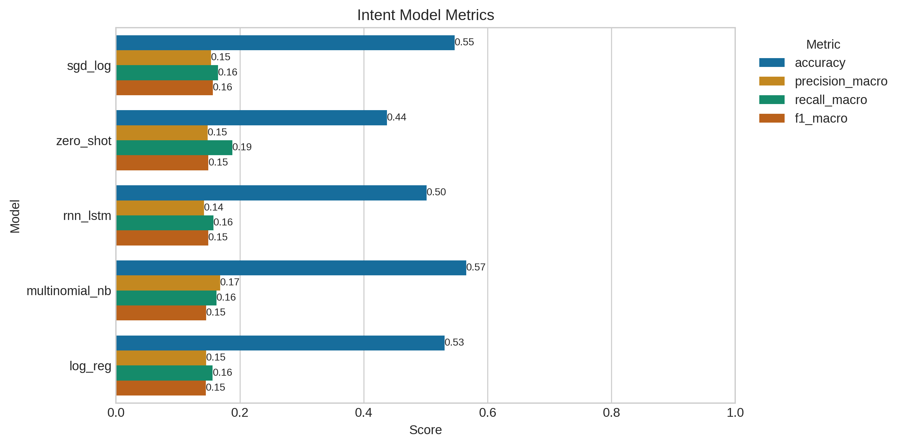
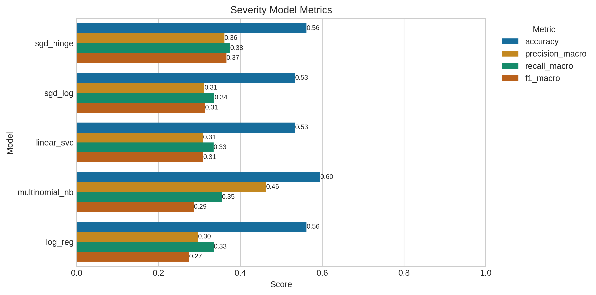
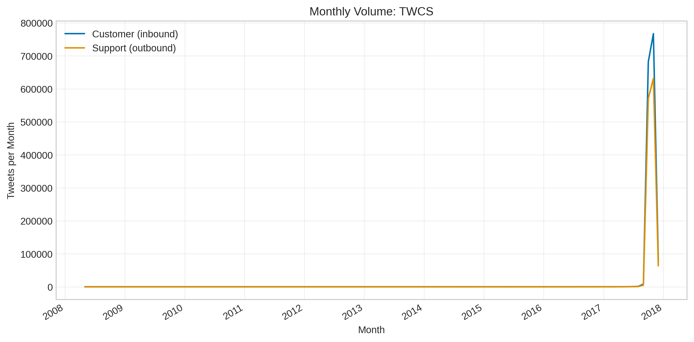
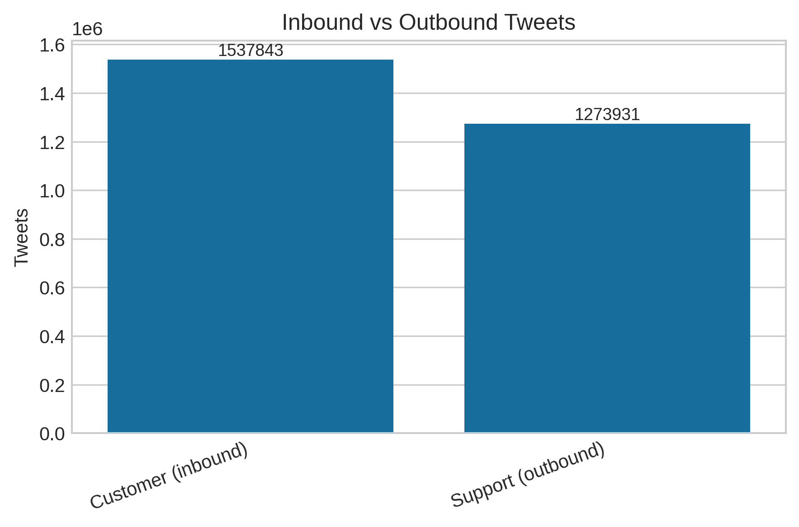
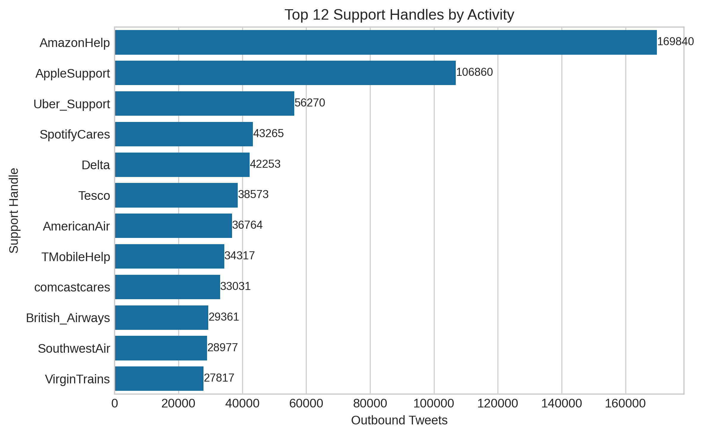
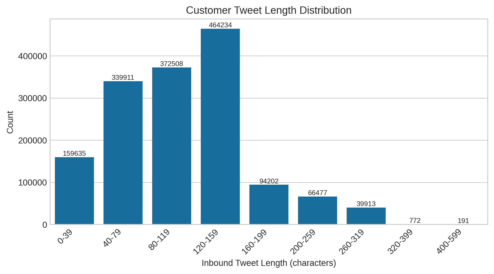

# Customer Support Intent/Severity Classification

## 1) What the project does
- Classifies customer tweets into an **intent** label (why they're contacting support) and a **severity** level (0-3 urgency). Predictions are powered by five models: Logistic Regression, SGD (logistic), zero-shot (DistilBERT MNLI), RNN + Bidirectional LSTM, and Multinomial Naive Bayes.
- Generates empathetic, context-aware replies based on the predicted intent/severity. Example:
  - Tweet: `@UPSHelp hi, do I have to wait for a delivery attempt before I change the del address?`
  - Answer (rnn_lstm): `Hi there! Thanks for reaching out. You can actually change the delivery address online or through the UPS app *before* a delivery attempt! Hope this helps! 😊`
- Provides visual EDA for the larger TWCS Twitter support dataset and plots comparing model metrics.

## 2) How it works (models, graphs, and results)
- **Pipeline:** Clean tweets → split train/test → fit five text models → evaluate intent/severity → save metrics to `results_summary.csv` → visualize metrics to `figures/` → (optionally) generate support replies.
- **Data:** Ground-truth manual labels live in `data/manual_labels.csv`. Optional TWCS raw data (`data/twcs.csv`) fuels the exploratory visuals.
- **Models:** Classic ML baselines (LogReg, SGD, Multinomial NB), a zero-shot MNLI classifier, and an RNN + BiLSTM. All are trained/evaluated via `src/main.py`.
- **Key results (rnn_lstm):**
  - Intent: accuracy 0.606, macro F1 0.392.
  - Severity: accuracy 0.920, macro F1 0.540.
- **Graphs and explanations:**
  -  — Accuracy/precision/recall/F1 by model for intent. Logistic Regression and RNN are close on accuracy (~0.61 vs. ~0.61) but all models show lower macro recall, reflecting class imbalance.
  -  — Same metrics for severity. Logistic Regression and RNN dominate; both near 0.92 accuracy, showing severity is easier than intent.
  -  — Raw TWCS tweet counts per month; highlights traffic surges.
  -  — Ratio of customer inbound vs. support outbound tweets.
  -  — Most active support accounts in TWCS.
  -  — Message length distribution for inbound tweets; useful for tokenizer/sequence-length choices.

## 3) How to run it
Prereqs: Python 3.10+, a virtual environment, and `data/manual_labels.csv` (committed). Add `data/twcs.csv` manually if you want the TWCS visuals.

1) Create and activate a virtual env, then install deps:
   - Conda:
     ```
     conda create -n cs-support-llm python=3.10 -y
     conda activate cs-support-llm
     ```
   - venv:
     ```
     python3 -m venv .venv
     source .venv/bin/activate
     ```
   Install requirements:
   ```
   pip install -r requirements.txt
   ```
2) Train/evaluate all five models on manual labels:
   ```
   python src/main.py
   ```
   Metrics print to console and save to `results_summary.csv`.
3) Visualize saved metrics (accuracy/precision/recall/F1 per model/task):
   ```
   python src/visualize_results_summary.py
   ```
   PNGs land in `figures/`.
4) (Optional) Generate TWCS exploratory visuals:
   ```
   python src/twcs_visualization.py
   ```
   Use `--chunk-size` to override the default 200k rows per batch. All figures are written to `figures/`.
